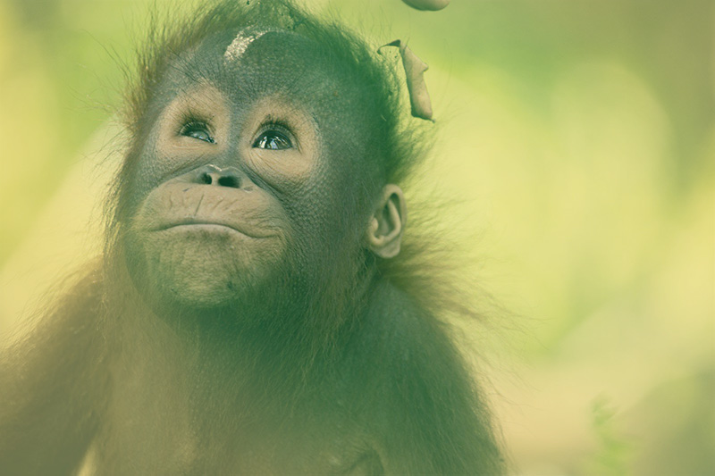
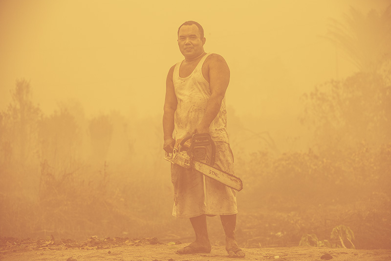
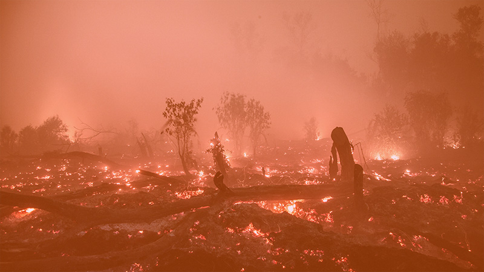
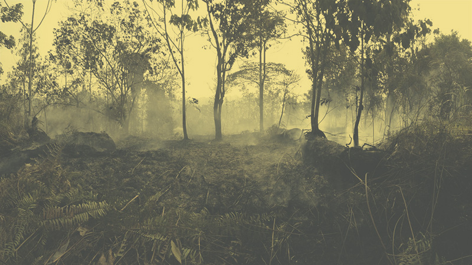

Lorem ipsum dolor...

Seit 2016 werden die Borneo Orang-Utans auf der Roten Liste der Weltnaturschutzunion (IUCN) als „akut vom Ausserben bedroht“ geführt.
International wie national stehen sie deshalb unter strengem Schutz. Ihr Lebensraum in der Regel aber nicht. Das Überleben der Letzten dieser Art kann deshalb nur gelingen, wenn wir den Regenwald bewahren: Nur wenn wir ihn retten, retten wir die Orang-Utans und mit ihnen zahlreiche andere gefährdete und endemische Arten.

{: .image.left}
  {:class="img-responsive"}
  *Quelle: Björn Vaughn, BPI*

Die meiste Zeit ihres Lebens verbringen Orang-Utans in den Baumkronen des Indonesischen Dschungels. Über Jahrtausende gewachsen, zählen diese Wälder zu den artenreichsten der Welt. Doch in wenigen Minuten werden die Urwaldriesen gefällt. In Sekunden werden enorme Flächen brandgerodet, um unseren wachsenden Hunger nach Kohle, Tropenholz oder Palmöl zu stillen. Plantagen entstehen, soweit das Auge reicht. Dieser massive Eingriff in die Natur vernichtet den natürlichen Lebensraum der Orang-Utans. Ganze Ökosysteme hängen von dieser Schlüsselart ab und gehen mit ihr zu Grunde.

{:figure .image.right}
  {:class="img-responsive"}
  *Quelle: Björn Vaughn, BPI*

Wegen ihres schwindenden Lebensraumes kommen jedes Jahr schätzungsweise 3 000 Orang-Utans ums Leben. In den letzten 20 Jahren haben die Orang-Utans 55 Prozent ihres natürlichen Lebensraumes verloren. Ihr Bestand ist deshalb in den letzten 20 bis 30 Jahren um mehr als 80 Prozent geschrumpft. Schon unsere Kinder und Enkelkinder könnten Orang-Utans in freier Wildbahn nicht mehr erleben!

Doch nicht nur die Biodiversität ist bedroht. Grossflächige Brandrodungen und die damit einhergehenden alljährlichen Wald- und Torfbrände beschleunigen auch den Klimawandel und gefährden die Gesundheit von Millionen Menschen.

Die Hälfte aller tropischen Torfmoorwälder befindet sich in Indonesien. Diese Wälder sind die Lunge der Welt, regeln unser Weltklima und binden 42.000 Megatonnen CO2. Werden sie zerstört, gelangen Unmengen an CO2 in die Atmosphäre. Brennen Torfmoorwälder, setzten sie vier bis 40-mal mehr CO2 frei, als Waldbrände in anderen tropischen Gebieten.

{:figure .image.left}
  {:class="img-responsive"}
  *Quelle: Björn Vaughn, BPI*

1997 brannten 1.5 Millionen Hektar Torfmoorwälder in Süd-Borneo ab und produzierten 13 bis 40 Prozent der weltweiten Treibhausgase in dem Jahr. 8 000 Borneo Orang-Utans starben. Innerhalb von diesem einen Jahr reduzierte sich so deren Population um 33 Prozent. Im Herbst 2015 brannte der Regenwald Indonesiens erneut. Vier Monate lang. Ununterbrochen. Auf einer Fläche, so gross wie die halbe Schweiz, loderten und schwelten 127 000 Feuer. Sie setzten 16 Mio. Tonnen CO2 pro Tag frei - mehr als die gesamten USA zeitgleich produzierten. Erneut starben tausende Orang-Utans in den Flammen und wir erlebten einen massiven Zustrom an Orang-Utans in den BOS-Rettungsstationen.

Auch 300 Hektar Regenwald rund um die BOS Rettungsstation in Samboja Lestari fielen 2015 den Flammen zum Opfer. In mühevoller Kleinarbeit war dieses Gebiet zuvor Baum für Baum aufgeforstet worden, denn am heutigen Standort der Rettungsstation befand sich vor rund 16 Jahren lediglich eine durch Abholzung und Waldbrände völlig ausgezehrte, nährstoff- und artenarme Grassteppe. Erst 2010 waren die Aufforstungsarbeiten weitgehend abgeschlossen und nahezu die gesamte zerstörte Fläche mit einem funktionierenden Regenwald bewachsen.

{:figure .image.right}
  {:class="img-responsive"}
  *Quelle: Björn Vaughn, BPI*

Das Gebiet beheimatet keine wilde Orang-Utan Population. In Samboja Lestari werden aber traumatisierte, verletzte und verwaiste Orang-Utans rehabilitiert und auf ihre Auswilderung vorbereitet. Zudem sind viele der ursprünglichen Tierarten in den aufgeforsteten Regenwald zurückgekehrt. Heute ist das Gebiet rund um die BOS-Rettungsstation in Samboja Lestari eine der letzten grünen Inseln der Region. Diese gilt es zu erhalten.
